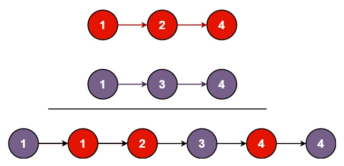

**You are given the heads of two sorted linked lists list1 and list2.**

**Merge the two lists into one sorted list. The list should be made by splicing together the nodes of the first two lists.**

**Return the head of the merged linked list.**
#


**Example 1:**

    Input: list1 = [1,2,4], list2 = [1,3,4]
    Output: [1,1,2,3,4,4]

**Example 2:**

    Input: list1 = [], list2 = []
    Output: []

**Example 3:**

    Input: list1 = [], list2 = [0]
    Output: [0]

**Pseudocode:**
```fake_code
solution function(ListNode list1, ListNode list2) 
    declare dummy node;
    declare current_node = dummy; //this node help add new node

    while list1 and list2 != null
        if list1.val >= list2.val 
            current_node.next = list2
            list2 = list2.next
        else 
            current_node.next = list2
            list2 = list2.next
    
    if list1 != null
        current_node.next = list1
    if list2 != null
        current_node = list2
    
    return dummy.next