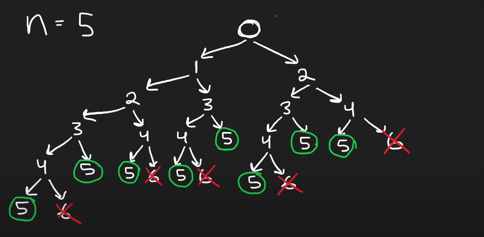
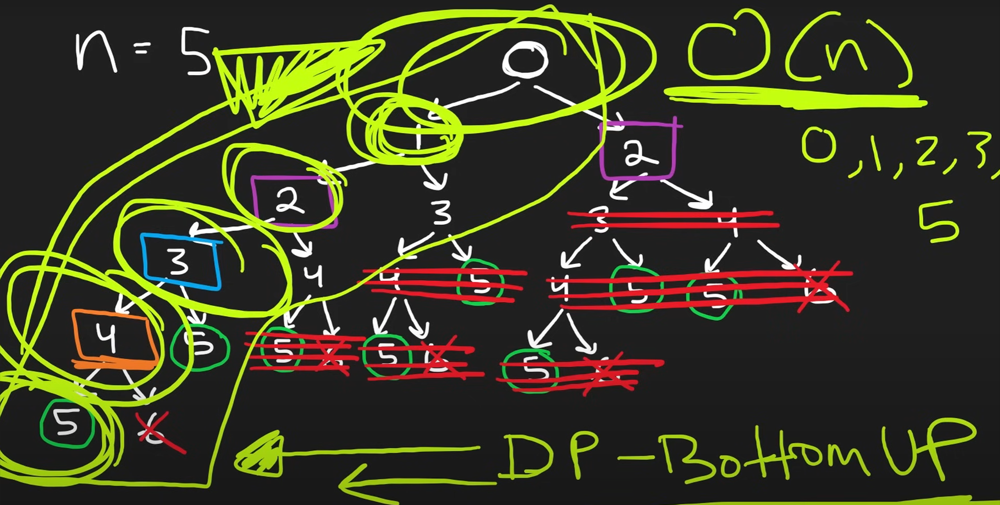
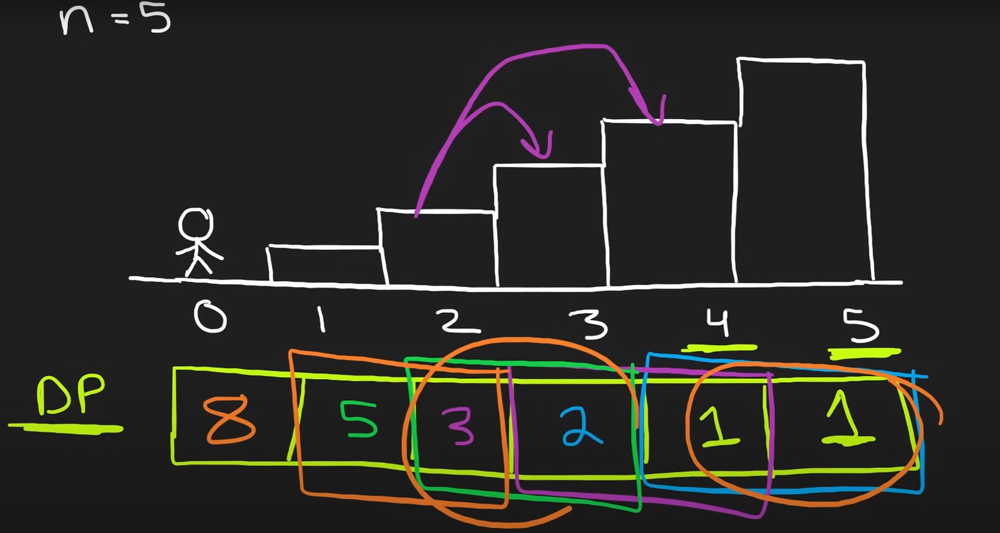

**You are climbing a staircase. It takes n steps to reach the top.**

**Each time you can either climb 1 or 2 steps. In how many distinct ways can you climb to the top?**

#

**Example 1:**

    Input: n = 2
    Output: 2

_Explanation: There are two ways to climb to the top._

_1. 1 step + 1 step_

_2. 2 steps_

**Example 2:**

    Input: n = 3
    Output: 3

_Explanation: There are three ways to climb to the top._

_1. 1 step + 1 step + 1 step_

_2. 1 step + 2 steps_

_3. 2 steps + 1 step_

**Explain:**

<div style="display: flex; gap: 5px"> 





</div>

**Pseudocode:**

```
solution function(int n)
    declare pre = next = 1
    declare ans = 1

    for i from 1 to n
        ans = pre + next
        pre = next
        next = ans

    return ans
```
